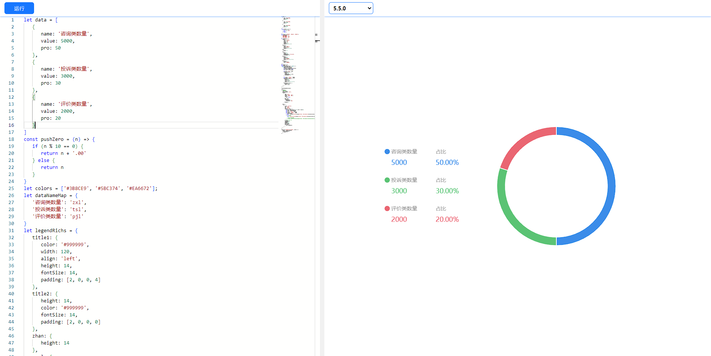

这是一个编辑echarts的Demos
- vite 5.x
- node 20.11.0
- vue3 + vite + ts

> 


```
.
├── public
│   ├── EchartsView
├── src
│   ├── Echarts
│   │   ├── api
│   │   ├── components
│   │   ├── index.vue
```
> public/EchartsView iframe的页面

> src/Echarts 主题页面

